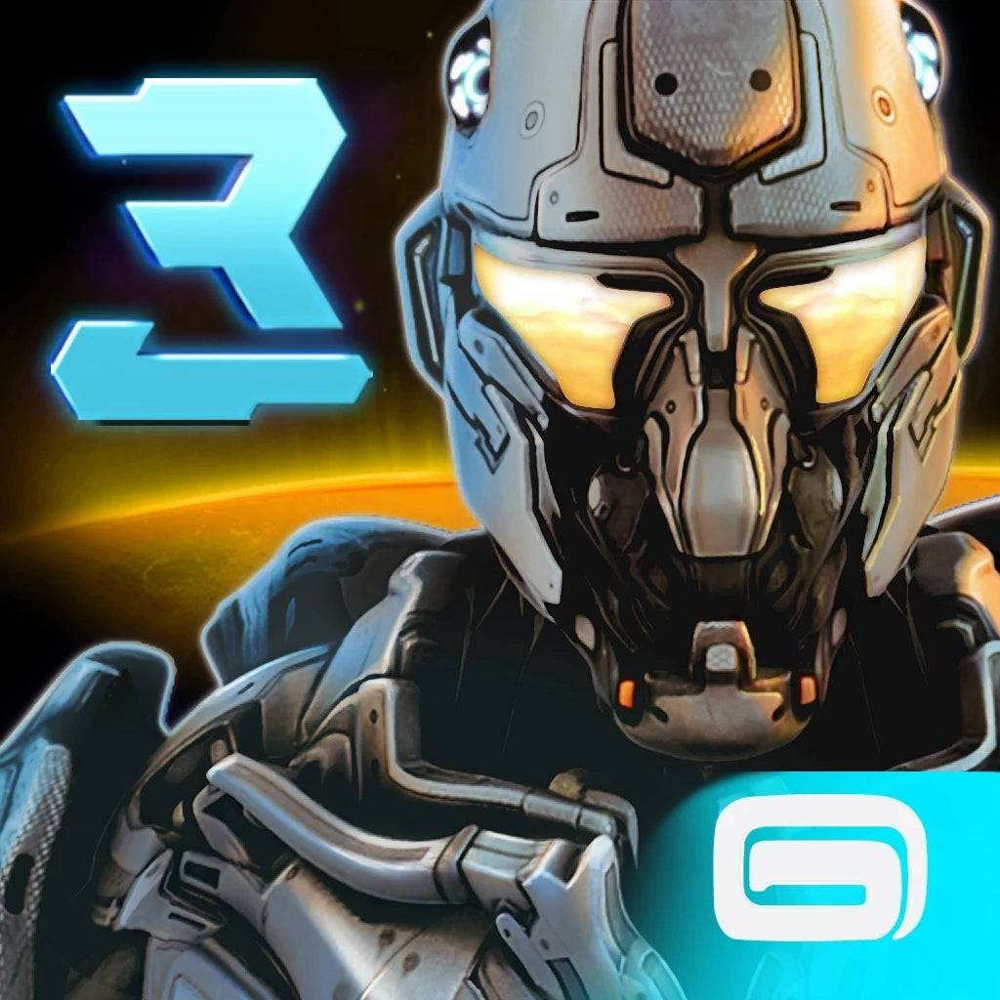

<div align="center">



# nova3_nx

**N.O.V.A. 3: Near Orbit Vanguard Alliance for Nintendo Switch**

An unofficial native Nintendo Switch wrapper for the 32-bit Android release of  
**N.O.V.A. 3: Near Orbit Vanguard Alliance**.

[](#)
[](#)
[](#)
[](LICENSE)

</div>

---

## About

`nova3_nx` is a native wrapper that runs the 32-bit ARM Android build of Gameloft's sci-fi FPS classic **N.O.V.A. 3: Near Orbit Vanguard Alliance** on Nintendo Switch.

Because the Tegra X1 processor in the Nintendo Switch natively supports 32-bit ARM (AArch32) execution, the game runs **directly on the hardware with full native speed**—no emulation involved.

> [!NOTE]
> **No game code or assets are included in this repository.**  
> Users must supply their own legally purchased copy of the game.

---

## Features

- **Full Native Performance:** Runs natively on the Switch hardware targeting a smooth 60 FPS.
- **Modern Controller Layout:** Full dual-stick aiming, sprint with L3, quick weapon swap with L1, and hold-to-aim with ZL.
- **Hardware-Accelerated Graphics:** Powered by OpenGL ES 2.0 via Mesa Nouveau for crisp 720p/1080p rendering.
- **Audio & Fast Loading:** Clear audio streaming and optimized RAM caching for seamless gameplay without MicroSD lag spikes.
- **Sphaira Forwarder Support:** Dedicated launcher that allows launching directly from the Switch HOME Menu.

---

## Requirements

### For Players
- A Nintendo Switch running **Atmosphère** custom firmware.
- The [Sphaira](https://github.com/ITotalJustice/sphaira) homebrew menu (installing Sphaira's forwarder is required so the system launches it in 32-bit mode).
- A copy of **nova3.apk** (v1.0.7, versionCode `1070`).
- The game's two OBB data files:
  - `main.1050.com.gameloft.android.ANMP.GloftN3HM.obb`
  - `patch.1070.com.gameloft.android.ANMP.GloftN3HM.obb`

---

## Installation Guide

### 1. Extract Game Data
1. Create a new folder on your computer named `files`.
2. Open/extract `main.1050.com.gameloft.android.ANMP.GloftN3HM.obb` into your `files` folder using 7-Zip or WinRAR.
3. Open/extract `patch.1070.com.gameloft.android.ANMP.GloftN3HM.obb` into the **same** `files` folder.
4. **Important**: When prompted, choose **Replace / Overwrite all** so the newer 1070 files replace some older 1050 files.

### 2. Extract the Game Library & Copy APK
1. Copy your `nova3.apk` directly into your Switch folder (`sdmc:/switch/nova3/nova3.apk`).
2. Open your `nova3.apk` with 7-Zip or WinRAR (or rename it to `nova3.zip`).
3. Go into `lib/armeabi-v7a/` and extract `libNOVA3_neon.so`.

### 3. Copy to MicroSD
1. Download `nova3.nro` from the [Releases](#) section.
2. On your Switch SD card, create the folder `sdmc:/switch/nova3/`.
3. Copy your files so the structure looks exactly like this:

```text
sdmc:/switch/nova3/
├── nova3.nro
├── nova3.apk
├── libNOVA3_neon.so
└── data/
    └── files/ (Paste the "files" folder from Step 1 here, so you have data/files/)
```

### 4. Launching the Game (32-bit execution)
1. Open **Sphaira** on your Switch.
2. Select **N.O.V.A. 3** and choose **Install Forwarder**.
3. Go back to your Switch HOME Menu and start the game directly from its icon!  
*(Alternatively, you can launch `nova3.nro` through Title Redirection by holding R while opening any installed Switch game).*

---

## Controls

| Button | Action |
| :--- | :--- |
| **Left Stick** | Move / Walk |
| **Right Stick** | Look / Aim Camera |
| **L3 (Stick Click)** | **Sprint / Run** (Click to toggle) |
| **L1 (L)** | **Change Weapon** |
| **Y** | **Special Ability** |
| **ZL** | **Aim Down Sights (ADS)** (Hold to aim) |
| **ZR** | **Shoot / Fire** |
| **R / B** | **Throw Grenade** |
| **X** | **Reload** |
| **A** | **Jump / Action** |
| **+ (Plus)** | Pause Menu |
| **- (Minus)** | Alternative Weapon Switch |
| **Touchscreen** | Menus and touch interface |

---

## Recommended sys-clk config — Optional

The game runs great on stock clocks, but the Switch power manager can put the GPU into "sleep mode" during light scenes because the game barely uses any GPU power, which can cause small hiccups.

To lock the game at a super smooth 60 FPS without draining extra battery, you can optionally set this profile in **sys-clk**:

```ini
[0100777777777000]
handheld_cpu=1224
handheld_gpu=230
docked_cpu=1224
docked_gpu=230
```

* **CPU @ 1224 MHz**: Gives extra headroom for loading and smooth asset streaming.
* **GPU @ 230 MHz**: Keeps the GPU constantly awake at a cool, battery-friendly baseline (stock handheld is 307–384 MHz, so 230 MHz is very low and safe).

We are trading -25% GPU clock for +20% CPU clock, so battery consumption remains roughly the same as stock clocks (or even less).

---

## Building from Source

### Prerequisites
- Linux (Ubuntu / Debian / Mint) or WSL2 on Windows
- **Docker**
- Git

### Build Instructions

1. **Clone the repository:**
   ```bash
   git clone --recursive https://github.com/markaurel13/nova3-nx.git
   cd nova3-nx
   ```

2. **Set up `libnx32` and `mesa32`:**
   - Build `libnx32`:
     ```bash
     git clone https://github.com/aks796/libnx32.git
     ./libnx32/build.sh
     ```
   - Download prebuilt `mesa32` into `portlibs32/`:
     ```bash
     mkdir -p portlibs32
     wget https://github.com/aks796/mesa32/releases/download/mesa-20.1.0-rc3/mesa32.zip -O /tmp/mesa32.zip
     unzip -q /tmp/mesa32.zip -d portlibs32/
     ```

3. **Build the game binary:**
   ```bash
   ./build.sh
   ```

4. **Build the launcher NRO:**
   ```bash
   cd launcher
   ./build.sh
   ```
   The compiled launcher will be located at `launcher/nova3.nro`.

---

## Credits & Acknowledgments

- **Gameloft**: Original creators of *N.O.V.A. 3: Near Orbit Vanguard Alliance*.
- **[aks796](https://github.com/aks796)**: For the [`android32`](https://github.com/aks796/android32) runtime, [`libnx32`](https://github.com/aks796/libnx32), and [`mesa32`](https://github.com/aks796/mesa32).
- **Rinnegatamante**: For reference work on mobile ports and loader architecture.
- **Switchbrew**: For `libnx` and tools.
- **SpliffCurryBeats**: For reference work (this project was inspired by his PS Vita N.O.V.A. 3 port).

---

## License

This project is licensed under the [MIT License](LICENSE).  
N.O.V.A. 3 is a registered trademark of Gameloft. This project is not affiliated with or endorsed by Gameloft.
